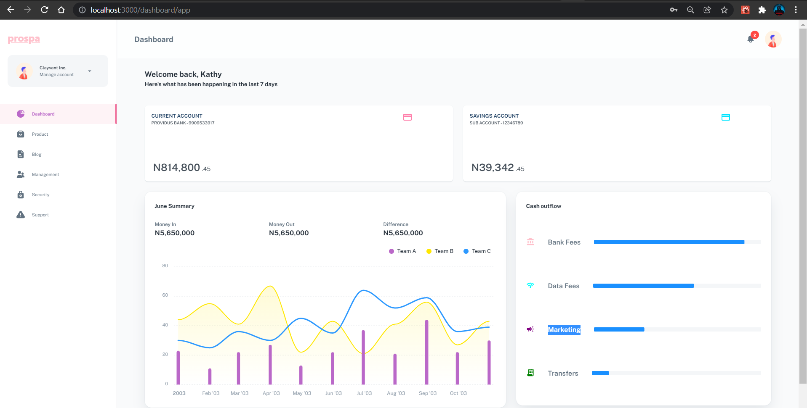

## Propsa [(Free version)](https://prospa-frontend.vercel.app/)

> Free React Admin Dashboard made with Material-UI components and React.

## Page demo

- [Dashboard](https://minimal-kit-react.vercel.app/dashboard/app)
- [Product](https://minimal-kit-react.vercel.app/dashboard/products)
- [Blog](https://minimal-kit-react.vercel.app/dashboard/blog)
- [Login](https://minimal-kit-react.vercel.app/login)
- [Register](https://minimal-kit-react.vercel.app/register)
- [Not Found](https://minimal-kit-react.vercel.app/404)

## Getting started

- Recommended `node js 14+` and `npm 6+`
- Install dependencies: `npm install` or `yarn install`
- Start the server: `npm run start` or `yarn start`

## License

Distributed under the MIT License. See [LICENSE](https://github.com/DesmondSanctity/prospa-frontend/blob/main/LICENSE) for more information.
